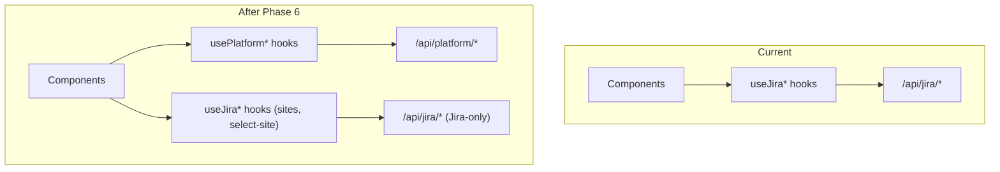

# Frontend Platform Generalization (Phase 6)

This is a large change touching ~30 hooks, 4 providers, and ~11 components. The approach is **incremental** -- each step can be verified independently without breaking the app.

## Strategy

Rather than renaming every `useJira`\* hook in-place (which would create a massive diff and risk merge conflicts), the plan uses **Option A: new platform hooks alongside old ones**. The old Jira hooks remain for backward compatibility and are consumed only if needed (e.g., Jira-specific sites/select-site logic has no Wrike equivalent yet).

---

## Step 1: Constants and shared types

- **[src/constants/systems.ts](src/constants/systems.ts)** -- add `WRIKE: "Wrike"` to `SYSTEMS`
- No changes needed to [src/types/create-task.ts](src/types/create-task.ts) -- it's already platform-neutral

## Step 2: New platform hooks (replacing Jira hooks)

Create new hooks under `src/hooks/` that call `/api/platform/`_ instead of `/api/jira/`_. Each mirrors an existing Jira hook but uses platform-neutral types:

| New hook              | Replaces                  | Endpoint                                            |
| --------------------- | ------------------------- | --------------------------------------------------- |
| `useProjects`         | `useJiraProjects`         | `GET /platform/projects`                            |
| `useIssueTypes`       | `useJiraIssueTypes`       | `GET /platform/issue-types?projectId=`              |
| `usePriorities`       | `useJiraPriorities`       | `GET /platform/priorities?projectId=`               |
| `useAssignees`        | `useJiraAssignees`        | `GET /platform/assignees?projectId=&query=`         |
| `useCurrentUser`      | `useJiraCurrentUser`      | `GET /platform/current-user`                        |
| `useProjectTasks`     | `useProjectIssues`        | `GET /platform/tasks?projectId=&cursor=&...filters` |
| `useTaskDetails`      | `useIssueDetails`         | `GET /platform/tasks/{taskId}`                      |
| `useCreateTask`       | `useCreateJiraTask`       | `POST /platform/tasks`                              |
| `useUpdateTask`       | `useUpdateJiraTask`       | `PATCH /platform/tasks/{taskId}`                    |
| `useDeleteTask`       | `useDeleteIssue`          | `DELETE /platform/tasks/{taskId}`                   |
| `useTaskComments`     | `useIssueComments`        | `GET /platform/comments?taskId=`                    |
| `useAddTaskComment`   | `useAddComment`           | `POST /platform/comments`                           |
| `useTaskTransitions`  | `useIssueTransitions`     | `GET /platform/tasks/{taskId}/transitions`          |
| `useTaskStatusChange` | `useIssueStatusChange`    | `POST /platform/tasks/{taskId}/transitions`         |
| `useProjectStatuses`  | `useProjectIssueStatuses` | `GET /platform/statuses?projectId=`                 |
| `useDeleteAttachment` | `useDeleteJiraAttachment` | `DELETE /platform/attachments/{id}`                 |

Hooks that remain Jira-specific (no platform equivalent needed yet):

- `useJiraSites`, `useJiraSelectSite`, `useJiraSelectProject` -- site/project selection is Jira-specific (Wrike doesn't have multi-site)
- `useJiraConnectionStatus`, `useDisconnectJira` -- auth status routes stay under `/api/auth/jira/` for now
- `useIssuePermission` -- Jira permissions API has no Wrike equivalent
- `useJiraWebhookSync` -- Supabase realtime, stays as-is
- `useOAuthPopupHandler` -- already generic, just needs the platform parameter

## Step 3: Providers

- **[src/providers/task-manager/TaskManagerProvider.tsx](src/providers/task-manager/TaskManagerProvider.tsx)** -- swap `useJiraProjects` to `useProjects`, `useProjectIssues` to `useProjectTasks`, change `JiraIssue` to `PlatformTask` in context type. Sites/connection status hooks stay Jira-specific for now.
- **[src/providers/create-task/JiraCreateTaskProvider.tsx](src/providers/create-task/JiraCreateTaskProvider.tsx)** -- rename to `CreateTaskProvider.tsx` (or create a new one). Swap to platform hooks (`useIssueTypes`, `usePriorities`, `useAssignees`, `useCurrentUser`, `useCreateTask`). The `uploadAttachments` URL changes from `/jira/attachment/upload` to the platform attachment endpoint. The `getAllowedParentTypeNames` logic should be conditional on platform (Wrike doesn't have issue-type hierarchy).
- **[src/providers/edit-task/JiraEditTaskProvider.tsx](src/providers/edit-task/JiraEditTaskProvider.tsx)** -- similar: swap to platform hooks, rename to `EditTaskProvider.tsx`.
- **[src/providers/auth-providers/JiraAuthFailureProvider.tsx](src/providers/auth-providers/JiraAuthFailureProvider.tsx)** -- generalize connect URL to use `/api/auth/connect?platform=jira` (or `wrike`). The reconnect dialog text should say "session expired" generically instead of "Jira session expired".

## Step 4: Components (type swaps)

These 11 component files import Jira types directly. Swap to platform types:

| Component              | Change                                                           |
| ---------------------- | ---------------------------------------------------------------- |
| `TaskDetails.tsx`      | `JiraIssue` to `PlatformTask`                                    |
| `SubtasksList.tsx`     | `JiraIssue` to `PlatformTask`                                    |
| `TaskComments.tsx`     | `JiraComment` to `PlatformComment`, `JiraUser` to `PlatformUser` |
| `CommentCard.tsx`      | `JiraComment` to `PlatformComment`                               |
| `PriorityBadge.tsx`    | `JiraPriority` to `PlatformPriority`                             |
| `StatusBadge.tsx`      | `JiraIssue` status type to `PlatformStatus`                      |
| `UserAvatar.tsx`       | `JiraUser` to `PlatformUser`                                     |
| `ProjectPicker.tsx`    | `JiraProject` to `PlatformProject`                               |
| `EditTaskButton.tsx`   | `JiraPermission` to `PlatformPermissionType`                     |
| `DeleteTaskButton.tsx` | `JiraPermission` to `PlatformPermissionType`                     |
| `AddCommentInput.tsx`  | `CreateCommentPayload` to `PlatformCreateCommentPayload`         |

## Step 5: Connection flow

- **[src/components/connections/ConnectionsList.tsx](src/components/connections/ConnectionsList.tsx)** -- render a Wrike card alongside the Jira card when `SYSTEMS.WRIKE` is available
- **[src/components/connections/ConnectJiraButton.tsx](src/components/connections/ConnectJiraButton.tsx)** -- generalize to `ConnectPlatformButton` that accepts `platform` prop and uses `/api/auth/connect?platform={platform}` URL
- **[src/components/common/AdfRenderer.tsx](src/components/common/AdfRenderer.tsx)** -- guard with a platform check; for Wrike, render plain HTML instead of ADF. The renderer stays as-is but is only invoked when `platform === "jira"`.

## Step 6: axiosClient refresh path

- **[src/lib/axiosClient.ts](src/lib/axiosClient.ts)** -- the 401-refresh logic currently calls `/api/auth/jira/refresh`. This should be generalized to call a platform-neutral refresh endpoint (or conditionally call the right one). For now, it can stay since only Jira connections exist and the refresh interceptor will be updated once both platforms are live.

---

## What NOT to change

- `**src/components/ui/`\*\*\* -- no Jira types, purely UI primitives
- **Work breakdown hooks/components** -- these are Jira-specific by nature (publish to Jira). Phase 7 will add a Wrike equivalent.
- `**useJiraWebhookSync`\*\* -- Supabase realtime subscription, stays as-is
- **Test files** -- existing tests reference Jira types; updating tests is out of scope for this phase

---

## Risks

- **Field mapping gaps**: Jira's `fields.description` (ADF object) vs Wrike's `description` (HTML string) -- components that render descriptions need a platform-aware renderer. The `AdfRenderer` must only be used for `platform === "jira"`.
- **Permissions**: Wrike has no `/mypermissions` equivalent. The `canCreateIssues` check in `TaskManagerProvider` should default to `true` for Wrike.
- **Sites concept**: Jira has multi-site (cloud instances). Wrike does not. The sites picker should be hidden when platform is Wrike.
