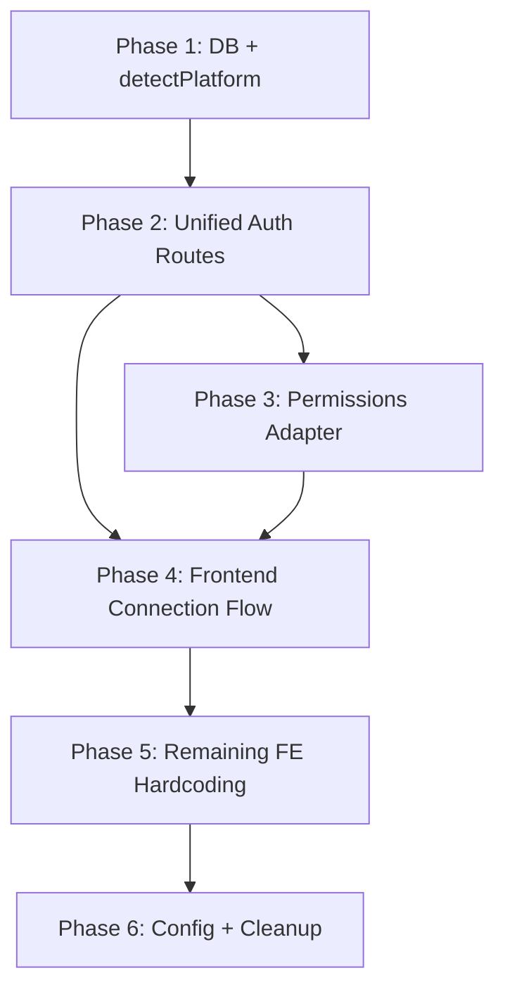

# Wrike Full Integration Plan

## Current State

The backend adapter (`WrikeAdapter`), service layer (`wrikeService`), OAuth connect/callback routes, and all `/api/platform/*` routes are already implemented. The blocker is that `detectPlatform()` always returns `"jira"`, the frontend uses Jira-specific hooks for connection management, and several UI components hardcode `platform="jira"`.

---

## Phase 1: Database + Platform Detection

Add a `platform` column so `detectPlatform()` can distinguish Jira from Wrike.

**Option A — Rename tables** (cleaner long-term):

- Rename `jira_connections` to `platform_connections`, `jira_sessions` to `platform_sessions`
- Rename columns: `jira_site` to `site`, `jira_project` to `project_id`, `jira_account_id` to `account_id`
- Add `platform TEXT NOT NULL DEFAULT 'jira'`
- Update all service files that reference old names: `jiraService.ts`, `wrikeService.ts`, `platformService.ts`, `platformUserId.ts`, `jiraUserId.ts`, all auth routes
- Update `supabase/schema.sql`

**Option B — Column only** (less risk):

- Add `platform TEXT NOT NULL DEFAULT 'jira'` to `jira_connections`
- Update `detectPlatform()` to read the new column
- Update `saveUserWrikeConnection()` to write `platform: 'wrike'`
- No table/column renames; existing code continues to work

**Decision: TBD** — both options documented; pick before starting.

Regardless of option, fix `[platformService.ts](src/services/platformService.ts)` `detectPlatform()`:

```typescript
async function detectPlatform(userId: string): Promise<PlatformType> {
  const { data } = await supabase
    .from("jira_connections") // or "platform_connections"
    .select("platform")
    .eq("user_id", userId)
    .eq("status", "active")
    .maybeSingle();
  return (data?.platform as PlatformType) ?? "jira";
}
```

Also update the Wrike OAuth callback (`[src/app/api/auth/callback/wrike/route.ts](src/app/api/auth/callback/wrike/route.ts)`) to write `platform: 'wrike'` when calling `saveUserWrikeConnection`.

---

## Phase 2: Unified Auth Routes

Currently the frontend uses three Jira-specific auth routes. We need platform-neutral equivalents.

### 2a. Unified connection status: `GET /api/auth/status`

- New route at `[src/app/api/auth/status/route.ts](src/app/api/auth/status/route.ts)`
- Reads the session cookie, queries the connection table, returns `{ connected: boolean, platform: PlatformType | null }`
- Replaces `[/api/auth/jira/status](src/app/api/auth/jira/status/route.ts)` for frontend use

### 2b. Unified token refresh: `POST /api/auth/refresh`

- New route at `[src/app/api/auth/refresh/route.ts](src/app/api/auth/refresh/route.ts)`
- Reads session, detects platform, calls `refreshUserJiraToken` or `refreshUserWrikeToken` accordingly
- Update `[axiosClient.ts](src/lib/axiosClient.ts)` line 40: change `/api/auth/jira/refresh` to `/api/auth/refresh`

### 2c. Unified disconnect: `POST /api/auth/disconnect`

- New route at `[src/app/api/auth/disconnect/route.ts](src/app/api/auth/disconnect/route.ts)`
- Detects platform, calls `disconnectUserJira` or `disconnectUserWrike`

### 2d. New hooks

- `useConnectionStatus()` — replaces `useJiraConnectionStatus`, returns `{ connected, platform }`
- `useDisconnect()` — replaces `useDisconnectJira`

Keep old Jira auth routes alive for backward compatibility (tests use them).

---

## Phase 3: Permissions Adapter

Add a `checkPermission` method to `[PlatformAdapter](src/platforms/base/PlatformAdapter.ts)`:

```typescript
checkPermission(
  token: PlatformToken,
  params: { permission: string; projectId?: string; taskId?: string },
): Promise<{ hasPermission: boolean }>;
```

- **JiraAdapter**: wraps existing `/rest/api/3/mypermissions` call
- **WrikeAdapter**: returns `{ hasPermission: true }` always

New platform route: `GET /api/platform/permissions`

New hook: `usePermission` (platform-neutral) — replaces the Jira-specific `[useIssuePermission.ts](src/hooks/useIssuePermission.ts)`

---

## Phase 4: Frontend Connection Flow

### 4a. Generalize `TaskManagerProvider`

`[TaskManagerProvider.tsx](src/providers/task-manager/TaskManagerProvider.tsx)` currently depends on:

- `useJiraConnectionStatus` → swap to `useConnectionStatus`
- `useJiraSites` → conditional: Jira needs site selection, Wrike does not
- `usePermission` (Jira-specific) → swap to platform-neutral `usePermission`
- `useOAuthPopupHandler` hardcodes `SYSTEMS.JIRA` → derive from `connectionStatus.platform`

Expose `platform: PlatformType | null` on the context so children can branch.

### 4b. Generalize connection UI

- `[ConnectionStatusBar.tsx](src/components/connections/ConnectionStatusBar.tsx)`: swap `useJiraConnectionStatus` / `useDisconnectJira` to new hooks; change "Connected to Jira" to `"Connected to ${platform}"`
- `[ConnectionSite.tsx](src/components/connections/ConnectionSite.tsx)`: render only when `platform === "jira"` (Wrike has no site concept)
- `[ProjectPickerSection.tsx](src/components/task-manager/ProjectPickerSection.tsx)`: swap `useJiraSelectProject` to a platform-neutral `useSelectProject` hook (Jira calls `/jira/select-project`; Wrike stores the folder ID)
- `[ConnectionsList.tsx](src/components/connections/ConnectionsList.tsx)`: already platform-neutral, just swap `useJiraConnectionStatus` to `useConnectionStatus`

### 4c. Retire `ConnectJiraButton`

`[ConnectJiraButton.tsx](src/components/connections/ConnectJiraButton.tsx)` points to `/api/auth/jira/connect`. Replace all usages with `ConnectPlatformButton` (already exists). Delete the file.

---

## Phase 5: Remaining Frontend Hardcoding

### 5a. Dynamic `platform` prop

- `[TaskManagerLayout.tsx](src/components/task-manager/TaskManagerLayout.tsx)` line 23: `platform="jira"` → read from `useTaskManager().platform`
- `[WorkBreakdownPreviewView.tsx](src/components/tasks/WorkBreakdownPreviewView.tsx)` line ~879: same fix

### 5b. Attachment URLs

`[EditTaskView.tsx](src/components/tasks/EditTaskView.tsx)` lines 342-379 build URLs as `/api/jira/attachment/${a.id}`. Change to `/api/platform/attachments/${a.id}`.

`[AdfRenderer.tsx](src/components/common/DescriptionRenderer.tsx)` — only used for Jira ADF content. The component conditionally renders based on description format, so no change needed (Wrike uses HTML, not ADF).

### 5c. Auth failure provider

`[JiraAuthFailureProvider.tsx](src/providers/auth-providers/JiraAuthFailureProvider.tsx)`:

- Rename to `AuthFailureProvider`
- On `OAUTH_CONNECTED`, accept any platform (not just `SYSTEMS.JIRA`)
- Reconnect URL: `/api/auth/connect?platform=${activePlatform}` instead of hardcoded Jira

---

## Phase 6: Config and Cleanup

- Add `WRIKE_CLIENT_ID`, `WRIKE_CLIENT_SECRET`, `WRIKE_REDIRECT_URI` to `[.env.example](.env.example)`
- Fix Wrike host resolution in the OAuth callback (persist actual datacenter host from token response)
- Delete dead code: `ConnectJiraButton`, old Jira-only hooks if fully replaced
- Update `[route-and-hook-audit.md](.cursor/docs/route-and-hook-audit.md)` with final state

---

## Dependency Graph



Phases 2 and 3 can be done in parallel once Phase 1 is complete. Phase 4 requires both.
