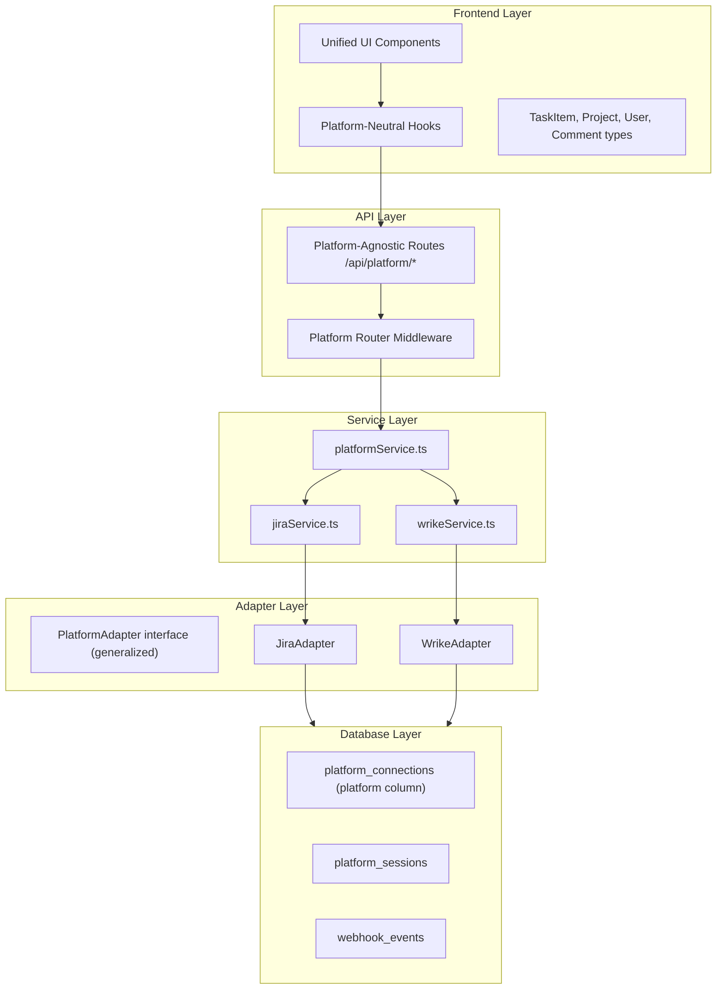

# Wrike Platform Integration Plan

## Current State Analysis

The codebase is **deeply coupled to Jira** at every layer:

- **Types:** All domain types are Jira-named (`JiraIssue`, `JiraProject`, `JiraUser`, etc.) in `[src/types/jira.ts](src/types/jira.ts)`
- **Adapter:** `[PlatformAdapter](src/platforms/base/PlatformAdapter.ts)` interface exists but uses Jira types — it is Jira-shaped, not generic. `[JiraAdapter](src/platforms/jira/JiraAdapter.ts)` has ~20 methods beyond the interface (comments, webhooks, transitions, etc.)
- **Service:** `[jiraService.ts](src/services/jiraService.ts)` (428 lines) is a thick Jira-specific orchestration layer
- **API routes:** All 29 route files live under `/api/jira/` and `/api/auth/jira/`, directly importing Jira types and services
- **Database:** Tables named `jira_connections`, `jira_sessions`, `jira_webhook_events` — no platform column
- **Frontend:** 16+ Jira-named hooks, 4 Jira-named providers, all components use `JiraIssue`/`JiraProject` types
- **Identity:** User = `jira_account_id` from `jira_sessions` — no platform-neutral user identity

The only platform-neutral piece is `[PlatformToken](src/types/platform.ts)` (access/refresh/expiry/tokenType).

---

## Wrike API Specifics and Concept Mapping

Wrike API v4 uses OAuth 2.0 (authorization code flow), similar to Jira but with key differences:

- **Multi-datacenter:** Wrike returns a `host` parameter during OAuth (e.g., `www.wrike.com`, `app-eu.wrike.com`). All API calls must use `https://{host}/api/v4`. This is analogous to Jira's `cloudId` approach.
- **No issue types:** Wrike has only tasks and subtasks (child tasks). There is no "issue type" concept (Bug, Story, Epic). The UI must gracefully omit or adapt this field.
- **Multiple assignees:** Wrike calls them "responsibles" and allows multiple per task. The unified UI should show the first responsible as the primary assignee.
- **Workflows and custom statuses:** Wrike uses `customStatusId` within a workflow, vs. Jira's transitions. Status changes are done via `PUT /tasks/{taskId}` with a `customStatusId`, not a separate transitions API.
- **No ADF:** Wrike comments and descriptions are plain text or HTML, not Atlassian Document Format. The `@razroo/html-to-adf` dependency is Jira-only.
- **No JQL:** Wrike uses structured filter parameters on `GET /tasks` (status, importance, responsibles, etc.), not a query language.
- **Priorities:** Wrike has a built-in `importance` field (High, Normal, Low) rather than configurable priority schemes.
- **Webhooks:** Account-level REST registration (similar to Jira dynamic webhooks but simpler — no JQL filter needed).

| Concept            | Jira                                | Wrike                               |
| ------------------ | ----------------------------------- | ----------------------------------- |
| Container          | Project (by key/id)                 | Folder/Project (by folderId)        |
| Work item          | Issue (with issue type)             | Task                                |
| Status change      | POST transitions/{id}               | PUT /tasks/{id} with customStatusId |
| Assignee           | Single assignee (accountId)         | Multiple responsibles (contactIds)  |
| Priority           | Configurable scheme (id/name)       | importance: High/Normal/Low         |
| Description format | ADF (Atlassian Document Format)     | Plain text or HTML                  |
| Query language     | JQL                                 | Structured filter params            |
| Auth URL           | auth.atlassian.com                  | login.wrike.com                     |
| API base           | api.atlassian.com/ex/jira/{cloudId} | {host}/api/v4                       |

---

## Architecture: Layered Abstraction



---

## Phase 1: Platform-Neutral Types

Create platform-agnostic domain types that both Jira and Wrike map onto.

**New file:** `src/types/platform-entities.ts`

```typescript
export type PlatformType = "jira" | "wrike";

export interface PlatformProject {
  id: string;
  key: string; // Jira: project key; Wrike: folderId
  name: string;
}

export interface PlatformUser {
  id: string; // Jira: accountId; Wrike: contactId
  displayName: string;
  avatarUrl?: string;
}

export interface PlatformTask {
  id: string;
  key: string; // Jira: issue key "PROJ-123"; Wrike: task permalink or ID
  summary: string;
  description?: string;
  status?: PlatformStatus;
  priority?: PlatformPriority;
  assignee?: PlatformUser;
  issueType?: PlatformIssueType; // null for Wrike
  createdDate?: string;
  dueDate?: string;
  parentKey?: string;
  platform: PlatformType;
}

export interface PlatformStatus {
  id: string;
  name: string;
}

export interface PlatformPriority {
  id: string;
  name: string;
  iconUrl?: string;
}

export interface PlatformIssueType {
  id: string;
  name: string;
  iconUrl?: string;
}

export interface PlatformComment {
  id: string;
  body: string; // normalized to plain text or HTML
  author?: PlatformUser;
  createdDate?: string;
}

export interface PlatformTransition {
  id: string;
  name: string;
  targetStatusId: string;
}

export interface CreateTaskPayload {
  projectId: string;
  summary: string;
  description?: string;
  issueTypeId?: string; // Jira only — ignored by Wrike
  priority?: string;
  assignee?: string;
  dueDate?: string;
  parentTaskKey?: string;
}

export interface UpdateTaskPayload {
  summary?: string;
  description?: string;
  priority?: string;
  assignee?: string;
  dueDate?: string;
  statusId?: string; // Wrike: customStatusId; Jira: use transitions
  parentTaskKey?: string;
  issueTypeId?: string; // Jira only
}
```

The existing `src/types/jira.ts` stays intact (used internally by `JiraAdapter`). A new `src/types/wrike.ts` will hold Wrike-specific API response types. Both adapters **map** their native types to `Platform` types.

---

## Phase 2: Generalize `PlatformAdapter` Interface

Rewrite `[src/platforms/base/PlatformAdapter.ts](src/platforms/base/PlatformAdapter.ts)` to use platform-neutral types:

```typescript
import type { PlatformToken } from "@/types/platform";
import type {
  PlatformProject,
  PlatformTask,
  PlatformUser,
  PlatformComment,
  PlatformIssueType,
  PlatformPriority,
  PlatformStatus,
  PlatformTransition,
  CreateTaskPayload,
  UpdateTaskPayload,
} from "@/types/platform-entities";

export interface PlatformAdapter {
  authenticate(authCode: string, redirectUri: string): Promise<PlatformToken>;
  refreshToken(token: PlatformToken): Promise<PlatformToken>;

  getProjects(token: PlatformToken): Promise<PlatformProject[]>;
  getIssueTypes(token: PlatformToken, projectId: string): Promise<PlatformIssueType[]>;
  getPriorities(token: PlatformToken, projectId?: string): Promise<PlatformPriority[]>;
  getStatuses(token: PlatformToken, projectId: string): Promise<PlatformStatus[]>;
  searchAssignees(
    token: PlatformToken,
    params: { projectId: string; query?: string },
  ): Promise<PlatformUser[]>;
  getCurrentUser(token: PlatformToken): Promise<PlatformUser>;

  getTasks(
    token: PlatformToken,
    projectId: string,
    cursor?: string,
    filters?: Record<string, string[]>,
  ): Promise<{ tasks: PlatformTask[]; nextCursor?: string; isLast: boolean }>;
  getTaskDetails(token: PlatformToken, taskId: string): Promise<PlatformTask>;
  createTask(token: PlatformToken, payload: CreateTaskPayload): Promise<PlatformTask>;
  updateTask(
    token: PlatformToken,
    taskId: string,
    payload: UpdateTaskPayload,
  ): Promise<PlatformTask>;
  deleteTask(token: PlatformToken, taskId: string): Promise<void>;

  getComments(token: PlatformToken, taskId: string): Promise<PlatformComment[]>;
  createComment(token: PlatformToken, taskId: string, text: string): Promise<PlatformComment>;

  getTransitions(token: PlatformToken, taskId: string): Promise<PlatformTransition[]>;
  changeStatus(token: PlatformToken, taskId: string, transitionOrStatusId: string): Promise<void>;

  getAttachmentContent(
    token: PlatformToken,
    attachmentId: string,
  ): Promise<{ data: ArrayBuffer; contentType: string }>;
  deleteAttachment(token: PlatformToken, attachmentId: string): Promise<void>;
}
```

`**JiraAdapter**` — refactor to implement this interface. All existing Jira-specific logic stays, but public methods return `Platform*` types (mapping internally). Jira-only features (e.g., ADF conversion, bulk move) remain as internal implementation details.

`**WrikeAdapter**` — new file `src/platforms/wrike/WrikeAdapter.ts` implementing the same interface against Wrike API v4. Key implementation notes:

- `getIssueTypes()` returns a single "Task" entry (Wrike has no issue types)
- `getPriorities()` returns fixed High/Normal/Low from Wrike's importance field
- `getTransitions()` returns available custom statuses from the project's workflow
- `changeStatus()` uses `PUT /tasks/{id}` with `customStatusId` instead of a transitions API
- Comments are plain text (no ADF conversion needed)
- Descriptions: accept HTML, no ADF conversion

---

## Phase 3: Database Schema Changes

Rename and generalize the database tables. Add a `platform` column to distinguish Jira vs. Wrike connections.

`**platform_connections**` (renamed from `jira_connections`):

- Add column: `platform TEXT NOT NULL DEFAULT 'jira'` — values: `'jira'` or `'wrike'`
- `jira_site` becomes `platform_site` (stores Jira cloudId or Wrike host)
- `jira_project` becomes `platform_project`
- Existing data migrated with `platform = 'jira'`

`**platform_sessions**` (renamed from `jira_sessions`):

- `jira_account_id` becomes `platform_account_id`
- Add column: `platform TEXT NOT NULL DEFAULT 'jira'`
- Cookie name changes from `jira_session_token` to `platform_session_token`

`**webhook_events**` (renamed from `jira_webhook_events`):

- Add column: `platform TEXT NOT NULL DEFAULT 'jira'`
- `issue_key` becomes `task_key`

**New env variables:**

- `WRIKE_CLIENT_ID`
- `WRIKE_CLIENT_SECRET`
- `WRIKE_REDIRECT_URI`

---

## Phase 4: Service Layer

**New file:** `src/services/platformService.ts` — a thin routing layer that reads the user's `platform` from their connection record and delegates to the appropriate platform service:

```typescript
export async function createAdapterForUser(userId: string) {
  const connection = await getUserConnection(userId); // reads platform_connections
  if (connection.platform === "wrike") {
    return createWrikeAdapterForUser(connection);
  }
  return createJiraAdapterForUser(connection);
}
```

`jiraService.ts` remains but its functions accept a pre-built adapter instead of constructing one internally. Similarly, `wrikeService.ts` handles any Wrike-specific orchestration (e.g., resolving workflowId for status changes).

---

## Phase 5: API Routes

Two approaches to consider (recommended: option A):

**Option A — Parallel platform-neutral routes:** Create new routes under `/api/platform/` that use `platformService` and work for both platforms. Keep existing `/api/jira/` routes temporarily for backward compatibility, then deprecate.

```
/api/platform/issues          → GET (list), POST (create)
/api/platform/issues/[id]     → GET (detail), PUT (update), DELETE
/api/platform/comments        → GET, POST
/api/platform/projects        → GET
/api/platform/statuses        → GET
/api/platform/priorities      → GET
/api/auth/connect             → GET (redirect to Jira or Wrike OAuth based on ?platform=)
/api/auth/callback/jira       → GET (Jira OAuth callback)
/api/auth/callback/wrike      → GET (Wrike OAuth callback)
```

The connect route reads `?platform=jira` or `?platform=wrike` and redirects to the appropriate OAuth URL.

**Session helper** `[src/helpers/jiraUserId.ts](src/helpers/jiraUserId.ts)` becomes `platformUserId.ts` — reads `platform_session_token` cookie, resolves from `platform_sessions` table.

---

## Phase 6: Frontend

- **Hooks:** Rename/generalize from `useJiraProjects` to `useProjects`, `useJiraIssueTypes` to `useIssueTypes`, etc. They call `/api/platform/`_ endpoints and return `Platform`_ types.
- **Providers:** `TaskManagerProvider` switches from `JiraIssue` to `PlatformTask`. The `JiraCreateTaskProvider` becomes `CreateTaskProvider`.
- **Components:** Replace `JiraIssue`/`JiraProject` type references with `PlatformTask`/`PlatformProject`. The `AdfRenderer` stays but is only invoked when `task.platform === "jira"`.
- **Connection flow:** The connect button offers a choice (Jira or Wrike). After selecting, the OAuth popup targets `/api/auth/connect?platform=jira` or `?platform=wrike`.
- **Conditional UI:** Issue type selector only renders when `platform === "jira"`. Wrike hides it. Priority selector maps Wrike's 3-level importance to the same `PlatformPriority` shape.

---

## Phase 7: Wrike-Specific Implementation Details

- **OAuth flow:** Authorize URL: `https://login.wrike.com/oauth2/authorize/v4?client_id={id}&response_type=code&redirect_uri={uri}`. Token endpoint: `POST https://login.wrike.com/oauth2/token` (differs from Jira's `auth.atlassian.com`). The callback returns a `host` parameter used as the API base.
- **Webhooks:** `POST https://{host}/api/v4/webhooks` with `hookUrl` and event filters. Simpler than Jira's JQL-based registration.
- **Rate limits:** Wrike allows 400 requests per minute per access token (vs. Jira's more complex rate limiting). The existing rate limiter middleware can stay.
- **Description rendering:** Wrike returns plain text or Markdown-like content. The existing `AdfRenderer` component should be wrapped in a platform-aware renderer that falls back to simple HTML rendering for Wrike.

---

## Recommended Implementation Order

The phases above are listed in dependency order. Within each phase:

1. Types first (no breaking changes, additive)
2. Adapter interface + WrikeAdapter (can be built in isolation)
3. DB migration (carefully — affects existing users)
4. Service layer refactor
5. API routes (new parallel routes, then migrate frontend)
6. Frontend (incremental — one hook/component at a time)
7. Remove deprecated Jira-specific routes after migration

---

## Risk Areas

- **DB migration:** Renaming tables affects existing deployments. Use proper Supabase migrations with `ALTER TABLE RENAME` and add columns with defaults.
- **Cookie rename:** Changing from `jira_session_token` to `platform_session_token` will log out all existing users. Consider supporting both cookie names during a transition period.
- **ADF renderer:** Currently used in task detail and comment views. Must not break for Jira users when rendering Wrike content. Guard with platform check.
- **Work breakdown / AI:** The `workbreakdown-jira.ts` bridge publishes drafts to Jira. This will need a `workbreakdown-wrike.ts` equivalent or a platform-neutral publish function.
