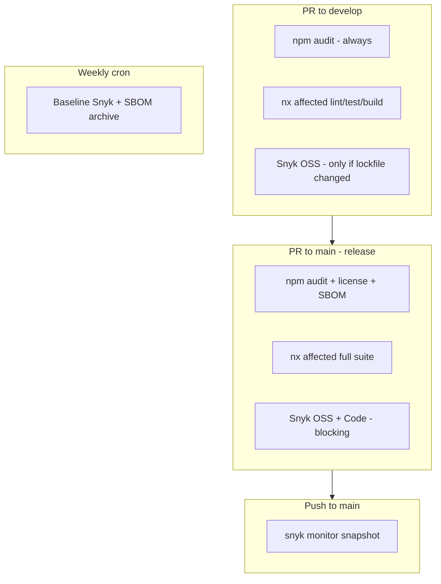

# CI & Security Scan Optimization Plan

> **Purpose:** Reduce GitHub Actions minutes and Snyk test quota while keeping production-ready gates.  
> **Last updated:** 2026-05-29  
> **Branch model:** feature → `develop` → `main` (release)

**Status legend:** `pending` | `in_progress` | `completed`

---

## Current state (before this plan)

| Source                                    | What runs                                           | Problem                                                                                                                                                          |
| ----------------------------------------- | --------------------------------------------------- | ---------------------------------------------------------------------------------------------------------------------------------------------------------------- |
| `.github/workflows/testing-pipeline.yaml` | Single job on every PR push (`synchronize`)         | ~3 min × every commit; Playwright + SBOM + license on every run                                                                                                  |
| **Snyk GitHub App (SCM)**                 | PR Checks on every PR open **and** every new commit | Each check counts toward Snyk quota ([Snyk PR checks docs](https://docs.snyk.io/scan-fix-and-prevent/prevent/pull-request-checks/configure-pull-request-checks)) |
| **Dependabot**                            | Weekly npm + Actions PRs                            | Expected; each PR triggers CI                                                                                                                                    |
| **Husky pre-commit**                      | lint-staged locally                                 | Not counted toward Actions minutes                                                                                                                               |

**Snyk is NOT in GitHub Actions today** — quota burn is from the Snyk SCM integration (webhooks), not this repo’s workflows. Moving Snyk into Actions with controlled triggers replaces uncontrolled SCM scans.

---

## Target architecture

---

## Manual configuration (GitHub + Snyk UI)

These steps **cannot** be done in code. Do them once after CI workflows merge.

| Step | Where                                        | Action                                                                                      |
| ---- | -------------------------------------------- | ------------------------------------------------------------------------------------------- |
| 1    | **Snyk** → Settings → Integrations → GitHub  | **Disable** automatic PR Checks (Open Source + Code), or set to **optional** (non-blocking) |
| 2    | **GitHub** → Settings → Branches → `main`    | Required checks: `Testing Pipeline` + `Security — Snyk` (release PRs only)                  |
| 3    | **GitHub** → Settings → Branches → `develop` | Required checks: `Testing Pipeline` only (Snyk optional/warn on deps PRs)                   |
| 4    | **GitHub** → Settings → Secrets → Actions    | Add `SNYK_TOKEN` (service account token from Snyk → Account settings → API token)           |
| 5    | **Snyk** → Projects                          | Keep repos imported for **monitoring** (recurring retests on `main` baseline)               |

**If Snyk SCM PR Checks stay enabled while Actions Snyk runs, you will still double-scan and burn quota.**

---

## Task breakdown

| ID    | Task                                                                  | Status    | Notes                                           |
| ----- | --------------------------------------------------------------------- | --------- | ----------------------------------------------- |
| CI-01 | Create this plan document                                             | completed | `docs/ci-optimization-plan.md`                  |
| CI-02 | Skip workflow for docs-only PRs (`paths-ignore`)                      | completed | Markdown/docs edits skip Actions entirely       |
| CI-03 | Add change detection (`dorny/paths-filter`) for conditional steps     | completed | deps / capabilities / shadows filters           |
| CI-04 | Run E2E only when nx affected projects have `e2e` target              | completed | Skip Playwright install when not needed         |
| CI-05 | Run SBOM + license only on deps change or release PR (`base=main`)    | completed | Biggest per-PR saving for feature work          |
| CI-06 | Run capability drift + audit only when capabilities/tools/apps change | completed | Dynamic apps via `nx show projects`             |
| CI-07 | Run shadow checks only when `libs/ui` or app components change        | completed |                                                 |
| CI-08 | Add `.github/workflows/security-snyk.yaml` (tiered PR scans)          | completed | OSS on develop+deps; full on `main` PR          |
| CI-09 | Add Snyk monitor on push to `main`                                    | completed | In `security-snyk.yaml`                         |
| CI-10 | Add weekly baseline security workflow (optional cron)                 | completed | `security-baseline.yaml`                        |
| CI-11 | Refactor `testing-pipeline.yaml` with conditional steps               | completed | Single job, one `npm ci`, skip heavy steps      |
| CI-12 | Update compliance docs to match new CI behavior                       | completed | security-testing + security-third-party-and-oss |
| CI-13 | Document `SNYK_TOKEN` in workflow comments + plan                     | completed | See manual config table above                   |

---

## Workflow reference (after implementation)

| Workflow                 | Trigger                          | Purpose                                      |
| ------------------------ | -------------------------------- | -------------------------------------------- |
| `testing-pipeline.yaml`  | PR → `develop`/`main` (non-docs) | nx affected quality + conditional compliance |
| `security-snyk.yaml`     | PR (tiered) + push `main`        | Controlled Snyk tests + monitor              |
| `security-baseline.yaml` | Weekly Mon 06:00 UTC + manual    | Full audit/SBOM without per-PR cost          |
| `release.yml`            | Push `main`                      | Version/changelog (unchanged)                |

---

## Expected savings

| Change                                 | Estimated reduction                |
| -------------------------------------- | ---------------------------------- |
| Docs-only PRs skip CI                  | 100% of runs for doc-only changes  |
| Skip Playwright when E2E not affected  | ~1–2 min per unaffected PR         |
| SBOM + license only on deps/release    | ~30–60 s per feature PR            |
| Disable Snyk SCM PR Checks             | 70–90% of Snyk quota (biggest win) |
| Snyk in Actions with path/branch gates | Predictable, bounded scans         |

---

## Resume here if interrupted

1. Confirm `SNYK_TOKEN` secret exists in GitHub
2. Disable Snyk SCM PR Checks in Snyk UI
3. Open a test PR to `develop` (code only) — verify E2E/SBOM skipped in logs
4. Open a release PR to `main` — verify Snyk + SBOM run
